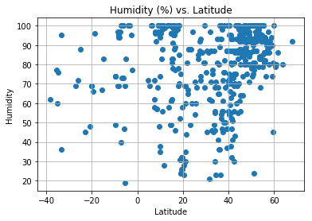
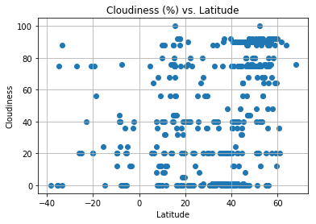
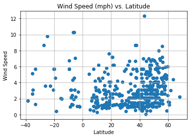

```python
import requests as req
import json
import pandas as pd
import numpy as np
import matplotlib.pyplot as plt
from citipy import citipy
import random
import itertools

# Weather API key
api_key = "c7f9f57b4779391ea1f5ae067591c971"

url = "http://api.openweathermap.org/data/2.5/weather?"
# Endpoint URL for five day forecast Phoenix, AZ
#target_url = "http://api.openweathermap.org/data/2.5/forecast?q=Phoenix,us&units=IMPERIAL&mode=json&APPID=" + api_key


world_cities_pd = pd.read_csv("worldCities.csv")
#world_cities_pd.head()

#cities = world_cities_pd.loc[world_cities_pd['City']]
cities = world_cities_pd
cities = cities.drop('Country', axis=1)
cities = cities.drop('Latitude', axis=1)
cities = cities.drop('Longitude', axis=1)
#cities.head()

#Convert dataframe to list
cities = cities.values.T.tolist()
#remove the extra bracket []
cities = list(itertools.chain(*cities))
#generate random 500 sample list of cities
random_cities = random.sample(cities, 500)

weather_data = []
temp = []
humidity = []
cloudiness = []
wind_speed = []
latitude = []
units = "metric"
n = 0


for city in random_cities:
    try:    
        query_url = (url + "appid=" + api_key + "&q=" + city + "&units=" + units)
        #print(query_url)
        weather_json = req.get(query_url).json()
        weather_data.append(weather_json)
        latitude.append(weather_json['coord']['lat'])
        temp.append(weather_json['main']['temp'])
        humidity.append(weather_json['main']['humidity'])
        cloudiness.append(weather_json['clouds']['all'])
        wind_speed.append(weather_json['wind']['speed'])
        print(str(int(n)) + " " + city + "\n" + query_url)
        n = n + 1
    except:
        print("Error with city data. Skipping")
        continue
```

    0 villebon-sur-yvette
    http://api.openweathermap.org/data/2.5/weather?appid=c7f9f57b4779391ea1f5ae067591c971&q=villebon-sur-yvette&units=metric
    1 caldararu
    http://api.openweathermap.org/data/2.5/weather?appid=c7f9f57b4779391ea1f5ae067591c971&q=caldararu&units=metric
    2 lalosu
    http://api.openweathermap.org/data/2.5/weather?appid=c7f9f57b4779391ea1f5ae067591c971&q=lalosu&units=metric
    3 jalor
    http://api.openweathermap.org/data/2.5/weather?appid=c7f9f57b4779391ea1f5ae067591c971&q=jalor&units=metric
    4 eloszallas
    http://api.openweathermap.org/data/2.5/weather?appid=c7f9f57b4779391ea1f5ae067591c971&q=eloszallas&units=metric
    5 mayong
    http://api.openweathermap.org/data/2.5/weather?appid=c7f9f57b4779391ea1f5ae067591c971&q=mayong&units=metric
    6 hanno
    http://api.openweathermap.org/data/2.5/weather?appid=c7f9f57b4779391ea1f5ae067591c971&q=hanno&units=metric
    7 fiche
    http://api.openweathermap.org/data/2.5/weather?appid=c7f9f57b4779391ea1f5ae067591c971&q=fiche&units=metric
    8 coacalco
    http://api.openweathermap.org/data/2.5/weather?appid=c7f9f57b4779391ea1f5ae067591c971&q=coacalco&units=metric
    Error with city data. Skipping
    9 rio linda
    http://api.openweathermap.org/data/2.5/weather?appid=c7f9f57b4779391ea1f5ae067591c971&q=rio linda&units=metric
    10 plainview
    http://api.openweathermap.org/data/2.5/weather?appid=c7f9f57b4779391ea1f5ae067591c971&q=plainview&units=metric
    11 sumabnit
    http://api.openweathermap.org/data/2.5/weather?appid=c7f9f57b4779391ea1f5ae067591c971&q=sumabnit&units=metric
    12 fantan
    http://api.openweathermap.org/data/2.5/weather?appid=c7f9f57b4779391ea1f5ae067591c971&q=fantan&units=metric
    13 vereshchagino
    http://api.openweathermap.org/data/2.5/weather?appid=c7f9f57b4779391ea1f5ae067591c971&q=vereshchagino&units=metric
    14 stoenesti
    http://api.openweathermap.org/data/2.5/weather?appid=c7f9f57b4779391ea1f5ae067591c971&q=stoenesti&units=metric
    15 guruvayur
    http://api.openweathermap.org/data/2.5/weather?appid=c7f9f57b4779391ea1f5ae067591c971&q=guruvayur&units=metric
    16 coronel bogado
    http://api.openweathermap.org/data/2.5/weather?appid=c7f9f57b4779391ea1f5ae067591c971&q=coronel bogado&units=metric
    17 lupsa
    http://api.openweathermap.org/data/2.5/weather?appid=c7f9f57b4779391ea1f5ae067591c971&q=lupsa&units=metric
    18 puebloviejo
    http://api.openweathermap.org/data/2.5/weather?appid=c7f9f57b4779391ea1f5ae067591c971&q=puebloviejo&units=metric
    19 gosainganj
    http://api.openweathermap.org/data/2.5/weather?appid=c7f9f57b4779391ea1f5ae067591c971&q=gosainganj&units=metric
    20 bururi
    http://api.openweathermap.org/data/2.5/weather?appid=c7f9f57b4779391ea1f5ae067591c971&q=bururi&units=metric
    21 munsingen
    http://api.openweathermap.org/data/2.5/weather?appid=c7f9f57b4779391ea1f5ae067591c971&q=munsingen&units=metric
    22 ferentino
    http://api.openweathermap.org/data/2.5/weather?appid=c7f9f57b4779391ea1f5ae067591c971&q=ferentino&units=metric
    23 ola
    http://api.openweathermap.org/data/2.5/weather?appid=c7f9f57b4779391ea1f5ae067591c971&q=ola&units=metric
    24 balint
    http://api.openweathermap.org/data/2.5/weather?appid=c7f9f57b4779391ea1f5ae067591c971&q=balint&units=metric
    25 schonebeck
    http://api.openweathermap.org/data/2.5/weather?appid=c7f9f57b4779391ea1f5ae067591c971&q=schonebeck&units=metric
    26 ottersberg
    http://api.openweathermap.org/data/2.5/weather?appid=c7f9f57b4779391ea1f5ae067591c971&q=ottersberg&units=metric
    27 klimovsk
    http://api.openweathermap.org/data/2.5/weather?appid=c7f9f57b4779391ea1f5ae067591c971&q=klimovsk&units=metric
    28 toda
    http://api.openweathermap.org/data/2.5/weather?appid=c7f9f57b4779391ea1f5ae067591c971&q=toda&units=metric
    29 streator
    http://api.openweathermap.org/data/2.5/weather?appid=c7f9f57b4779391ea1f5ae067591c971&q=streator&units=metric
    30 iwai
    http://api.openweathermap.org/data/2.5/weather?appid=c7f9f57b4779391ea1f5ae067591c971&q=iwai&units=metric
    31 serramanna
    http://api.openweathermap.org/data/2.5/weather?appid=c7f9f57b4779391ea1f5ae067591c971&q=serramanna&units=metric
    32 tezpur
    http://api.openweathermap.org/data/2.5/weather?appid=c7f9f57b4779391ea1f5ae067591c971&q=tezpur&units=metric
    33 tlaxcala
    http://api.openweathermap.org/data/2.5/weather?appid=c7f9f57b4779391ea1f5ae067591c971&q=tlaxcala&units=metric
    34 atulayan
    http://api.openweathermap.org/data/2.5/weather?appid=c7f9f57b4779391ea1f5ae067591c971&q=atulayan&units=metric
    35 zoniana
    http://api.openweathermap.org/data/2.5/weather?appid=c7f9f57b4779391ea1f5ae067591c971&q=zoniana&units=metric
    36 ngunut
    http://api.openweathermap.org/data/2.5/weather?appid=c7f9f57b4779391ea1f5ae067591c971&q=ngunut&units=metric
    37 lavello
    http://api.openweathermap.org/data/2.5/weather?appid=c7f9f57b4779391ea1f5ae067591c971&q=lavello&units=metric
    38 kumi
    http://api.openweathermap.org/data/2.5/weather?appid=c7f9f57b4779391ea1f5ae067591c971&q=kumi&units=metric
    39 semibratovo
    http://api.openweathermap.org/data/2.5/weather?appid=c7f9f57b4779391ea1f5ae067591c971&q=semibratovo&units=metric
    40 duiven
    http://api.openweathermap.org/data/2.5/weather?appid=c7f9f57b4779391ea1f5ae067591c971&q=duiven&units=metric
    41 hoquiam
    http://api.openweathermap.org/data/2.5/weather?appid=c7f9f57b4779391ea1f5ae067591c971&q=hoquiam&units=metric
    42 wittingen
    http://api.openweathermap.org/data/2.5/weather?appid=c7f9f57b4779391ea1f5ae067591c971&q=wittingen&units=metric
    43 kozani
    http://api.openweathermap.org/data/2.5/weather?appid=c7f9f57b4779391ea1f5ae067591c971&q=kozani&units=metric
    44 izhevsk
    http://api.openweathermap.org/data/2.5/weather?appid=c7f9f57b4779391ea1f5ae067591c971&q=izhevsk&units=metric
    45 paujiles
    http://api.openweathermap.org/data/2.5/weather?appid=c7f9f57b4779391ea1f5ae067591c971&q=paujiles&units=metric
    46 atima
    http://api.openweathermap.org/data/2.5/weather?appid=c7f9f57b4779391ea1f5ae067591c971&q=atima&units=metric
    47 guiong
    http://api.openweathermap.org/data/2.5/weather?appid=c7f9f57b4779391ea1f5ae067591c971&q=guiong&units=metric
    48 amboasary
    http://api.openweathermap.org/data/2.5/weather?appid=c7f9f57b4779391ea1f5ae067591c971&q=amboasary&units=metric
    Error with city data. Skipping
    49 carot
    http://api.openweathermap.org/data/2.5/weather?appid=c7f9f57b4779391ea1f5ae067591c971&q=carot&units=metric
    50 ismailia
    http://api.openweathermap.org/data/2.5/weather?appid=c7f9f57b4779391ea1f5ae067591c971&q=ismailia&units=metric
    51 gusev
    http://api.openweathermap.org/data/2.5/weather?appid=c7f9f57b4779391ea1f5ae067591c971&q=gusev&units=metric
    Error with city data. Skipping
    52 cavarzere
    http://api.openweathermap.org/data/2.5/weather?appid=c7f9f57b4779391ea1f5ae067591c971&q=cavarzere&units=metric
    53 aix-les-bains
    http://api.openweathermap.org/data/2.5/weather?appid=c7f9f57b4779391ea1f5ae067591c971&q=aix-les-bains&units=metric
    54 niltepec
    http://api.openweathermap.org/data/2.5/weather?appid=c7f9f57b4779391ea1f5ae067591c971&q=niltepec&units=metric
    55 kavarna
    http://api.openweathermap.org/data/2.5/weather?appid=c7f9f57b4779391ea1f5ae067591c971&q=kavarna&units=metric
    56 kosterevo
    http://api.openweathermap.org/data/2.5/weather?appid=c7f9f57b4779391ea1f5ae067591c971&q=kosterevo&units=metric
    57 castlecomer
    http://api.openweathermap.org/data/2.5/weather?appid=c7f9f57b4779391ea1f5ae067591c971&q=castlecomer&units=metric
    Error with city data. Skipping
    58 moosomin
    http://api.openweathermap.org/data/2.5/weather?appid=c7f9f57b4779391ea1f5ae067591c971&q=moosomin&units=metric
    59 chukhloma
    http://api.openweathermap.org/data/2.5/weather?appid=c7f9f57b4779391ea1f5ae067591c971&q=chukhloma&units=metric
    60 acamixtla
    http://api.openweathermap.org/data/2.5/weather?appid=c7f9f57b4779391ea1f5ae067591c971&q=acamixtla&units=metric
    61 magistralnyy
    http://api.openweathermap.org/data/2.5/weather?appid=c7f9f57b4779391ea1f5ae067591c971&q=magistralnyy&units=metric
    62 taleigao
    http://api.openweathermap.org/data/2.5/weather?appid=c7f9f57b4779391ea1f5ae067591c971&q=taleigao&units=metric
    63 marysville
    http://api.openweathermap.org/data/2.5/weather?appid=c7f9f57b4779391ea1f5ae067591c971&q=marysville&units=metric
    64 davila
    http://api.openweathermap.org/data/2.5/weather?appid=c7f9f57b4779391ea1f5ae067591c971&q=davila&units=metric
    65 boldumsaz
    http://api.openweathermap.org/data/2.5/weather?appid=c7f9f57b4779391ea1f5ae067591c971&q=boldumsaz&units=metric
    66 la ronge
    http://api.openweathermap.org/data/2.5/weather?appid=c7f9f57b4779391ea1f5ae067591c971&q=la ronge&units=metric
    67 saint-leu-la-foret
    http://api.openweathermap.org/data/2.5/weather?appid=c7f9f57b4779391ea1f5ae067591c971&q=saint-leu-la-foret&units=metric
    68 pathardih
    http://api.openweathermap.org/data/2.5/weather?appid=c7f9f57b4779391ea1f5ae067591c971&q=pathardih&units=metric
    69 campinas
    http://api.openweathermap.org/data/2.5/weather?appid=c7f9f57b4779391ea1f5ae067591c971&q=campinas&units=metric
    70 mimon
    http://api.openweathermap.org/data/2.5/weather?appid=c7f9f57b4779391ea1f5ae067591c971&q=mimon&units=metric
    Error with city data. Skipping
    71 murzzuschlag
    http://api.openweathermap.org/data/2.5/weather?appid=c7f9f57b4779391ea1f5ae067591c971&q=murzzuschlag&units=metric
    Error with city data. Skipping
    72 panevezys
    http://api.openweathermap.org/data/2.5/weather?appid=c7f9f57b4779391ea1f5ae067591c971&q=panevezys&units=metric
    73 southampton
    http://api.openweathermap.org/data/2.5/weather?appid=c7f9f57b4779391ea1f5ae067591c971&q=southampton&units=metric
    Error with city data. Skipping
    74 wichita
    http://api.openweathermap.org/data/2.5/weather?appid=c7f9f57b4779391ea1f5ae067591c971&q=wichita&units=metric
    75 frondenberg
    http://api.openweathermap.org/data/2.5/weather?appid=c7f9f57b4779391ea1f5ae067591c971&q=frondenberg&units=metric
    76 madoc
    http://api.openweathermap.org/data/2.5/weather?appid=c7f9f57b4779391ea1f5ae067591c971&q=madoc&units=metric
    77 aleksandrovsk
    http://api.openweathermap.org/data/2.5/weather?appid=c7f9f57b4779391ea1f5ae067591c971&q=aleksandrovsk&units=metric
    Error with city data. Skipping
    Error with city data. Skipping
    78 quecholac
    http://api.openweathermap.org/data/2.5/weather?appid=c7f9f57b4779391ea1f5ae067591c971&q=quecholac&units=metric
    79 rosendal
    http://api.openweathermap.org/data/2.5/weather?appid=c7f9f57b4779391ea1f5ae067591c971&q=rosendal&units=metric
    80 kosmynino
    http://api.openweathermap.org/data/2.5/weather?appid=c7f9f57b4779391ea1f5ae067591c971&q=kosmynino&units=metric
    81 usumatlan
    http://api.openweathermap.org/data/2.5/weather?appid=c7f9f57b4779391ea1f5ae067591c971&q=usumatlan&units=metric
    82 newport
    http://api.openweathermap.org/data/2.5/weather?appid=c7f9f57b4779391ea1f5ae067591c971&q=newport&units=metric
    Error with city data. Skipping
    83 novopokrovka
    http://api.openweathermap.org/data/2.5/weather?appid=c7f9f57b4779391ea1f5ae067591c971&q=novopokrovka&units=metric
    84 sierra madre
    http://api.openweathermap.org/data/2.5/weather?appid=c7f9f57b4779391ea1f5ae067591c971&q=sierra madre&units=metric
    85 holland
    http://api.openweathermap.org/data/2.5/weather?appid=c7f9f57b4779391ea1f5ae067591c971&q=holland&units=metric
    86 congomah
    http://api.openweathermap.org/data/2.5/weather?appid=c7f9f57b4779391ea1f5ae067591c971&q=congomah&units=metric
    87 maltrata
    http://api.openweathermap.org/data/2.5/weather?appid=c7f9f57b4779391ea1f5ae067591c971&q=maltrata&units=metric
    Error with city data. Skipping
    88 bessonovka
    http://api.openweathermap.org/data/2.5/weather?appid=c7f9f57b4779391ea1f5ae067591c971&q=bessonovka&units=metric
    89 ocnele mari
    http://api.openweathermap.org/data/2.5/weather?appid=c7f9f57b4779391ea1f5ae067591c971&q=ocnele mari&units=metric
    90 pabrade
    http://api.openweathermap.org/data/2.5/weather?appid=c7f9f57b4779391ea1f5ae067591c971&q=pabrade&units=metric
    91 blieskastel
    http://api.openweathermap.org/data/2.5/weather?appid=c7f9f57b4779391ea1f5ae067591c971&q=blieskastel&units=metric
    92 moreno
    http://api.openweathermap.org/data/2.5/weather?appid=c7f9f57b4779391ea1f5ae067591c971&q=moreno&units=metric
    93 varnsdorf
    http://api.openweathermap.org/data/2.5/weather?appid=c7f9f57b4779391ea1f5ae067591c971&q=varnsdorf&units=metric
    Error with city data. Skipping
    94 nyakabindi
    http://api.openweathermap.org/data/2.5/weather?appid=c7f9f57b4779391ea1f5ae067591c971&q=nyakabindi&units=metric
    95 sanlucar de barrameda
    http://api.openweathermap.org/data/2.5/weather?appid=c7f9f57b4779391ea1f5ae067591c971&q=sanlucar de barrameda&units=metric
    96 eden
    http://api.openweathermap.org/data/2.5/weather?appid=c7f9f57b4779391ea1f5ae067591c971&q=eden&units=metric
    97 brookline
    http://api.openweathermap.org/data/2.5/weather?appid=c7f9f57b4779391ea1f5ae067591c971&q=brookline&units=metric
    Error with city data. Skipping
    98 yautepec
    http://api.openweathermap.org/data/2.5/weather?appid=c7f9f57b4779391ea1f5ae067591c971&q=yautepec&units=metric
    99 brzeg
    http://api.openweathermap.org/data/2.5/weather?appid=c7f9f57b4779391ea1f5ae067591c971&q=brzeg&units=metric
    100 moacsa
    http://api.openweathermap.org/data/2.5/weather?appid=c7f9f57b4779391ea1f5ae067591c971&q=moacsa&units=metric
    101 bogota
    http://api.openweathermap.org/data/2.5/weather?appid=c7f9f57b4779391ea1f5ae067591c971&q=bogota&units=metric
    102 kasaoka
    http://api.openweathermap.org/data/2.5/weather?appid=c7f9f57b4779391ea1f5ae067591c971&q=kasaoka&units=metric
    103 amsterdam
    http://api.openweathermap.org/data/2.5/weather?appid=c7f9f57b4779391ea1f5ae067591c971&q=amsterdam&units=metric
    104 davidson
    http://api.openweathermap.org/data/2.5/weather?appid=c7f9f57b4779391ea1f5ae067591c971&q=davidson&units=metric
    105 sieu-magherus
    http://api.openweathermap.org/data/2.5/weather?appid=c7f9f57b4779391ea1f5ae067591c971&q=sieu-magherus&units=metric
    106 brunswick
    http://api.openweathermap.org/data/2.5/weather?appid=c7f9f57b4779391ea1f5ae067591c971&q=brunswick&units=metric
    107 malibu
    http://api.openweathermap.org/data/2.5/weather?appid=c7f9f57b4779391ea1f5ae067591c971&q=malibu&units=metric
    108 artena
    http://api.openweathermap.org/data/2.5/weather?appid=c7f9f57b4779391ea1f5ae067591c971&q=artena&units=metric
    109 fauvillers
    http://api.openweathermap.org/data/2.5/weather?appid=c7f9f57b4779391ea1f5ae067591c971&q=fauvillers&units=metric
    110 bay-khaak
    http://api.openweathermap.org/data/2.5/weather?appid=c7f9f57b4779391ea1f5ae067591c971&q=bay-khaak&units=metric
    111 dunabogdany
    http://api.openweathermap.org/data/2.5/weather?appid=c7f9f57b4779391ea1f5ae067591c971&q=dunabogdany&units=metric
    112 bagumbayan
    http://api.openweathermap.org/data/2.5/weather?appid=c7f9f57b4779391ea1f5ae067591c971&q=bagumbayan&units=metric
    113 banyumas
    http://api.openweathermap.org/data/2.5/weather?appid=c7f9f57b4779391ea1f5ae067591c971&q=banyumas&units=metric
    Error with city data. Skipping
    114 baden
    http://api.openweathermap.org/data/2.5/weather?appid=c7f9f57b4779391ea1f5ae067591c971&q=baden&units=metric
    115 malokakhovka
    http://api.openweathermap.org/data/2.5/weather?appid=c7f9f57b4779391ea1f5ae067591c971&q=malokakhovka&units=metric
    116 tinaquillo
    http://api.openweathermap.org/data/2.5/weather?appid=c7f9f57b4779391ea1f5ae067591c971&q=tinaquillo&units=metric
    117 umi
    http://api.openweathermap.org/data/2.5/weather?appid=c7f9f57b4779391ea1f5ae067591c971&q=umi&units=metric
    118 severnoye
    http://api.openweathermap.org/data/2.5/weather?appid=c7f9f57b4779391ea1f5ae067591c971&q=severnoye&units=metric
    119 cueto
    http://api.openweathermap.org/data/2.5/weather?appid=c7f9f57b4779391ea1f5ae067591c971&q=cueto&units=metric
    120 alanganallur
    http://api.openweathermap.org/data/2.5/weather?appid=c7f9f57b4779391ea1f5ae067591c971&q=alanganallur&units=metric
    121 abalak
    http://api.openweathermap.org/data/2.5/weather?appid=c7f9f57b4779391ea1f5ae067591c971&q=abalak&units=metric
    122 johnston
    http://api.openweathermap.org/data/2.5/weather?appid=c7f9f57b4779391ea1f5ae067591c971&q=johnston&units=metric
    123 wabash
    http://api.openweathermap.org/data/2.5/weather?appid=c7f9f57b4779391ea1f5ae067591c971&q=wabash&units=metric
    124 valerik
    http://api.openweathermap.org/data/2.5/weather?appid=c7f9f57b4779391ea1f5ae067591c971&q=valerik&units=metric
    125 albesti
    http://api.openweathermap.org/data/2.5/weather?appid=c7f9f57b4779391ea1f5ae067591c971&q=albesti&units=metric
    126 san andres xecul
    http://api.openweathermap.org/data/2.5/weather?appid=c7f9f57b4779391ea1f5ae067591c971&q=san andres xecul&units=metric
    127 peleduy
    http://api.openweathermap.org/data/2.5/weather?appid=c7f9f57b4779391ea1f5ae067591c971&q=peleduy&units=metric
    128 zayukovo
    http://api.openweathermap.org/data/2.5/weather?appid=c7f9f57b4779391ea1f5ae067591c971&q=zayukovo&units=metric
    129 el rosario
    http://api.openweathermap.org/data/2.5/weather?appid=c7f9f57b4779391ea1f5ae067591c971&q=el rosario&units=metric
    130 krasnaya zarya
    http://api.openweathermap.org/data/2.5/weather?appid=c7f9f57b4779391ea1f5ae067591c971&q=krasnaya zarya&units=metric
    131 nova olimpia
    http://api.openweathermap.org/data/2.5/weather?appid=c7f9f57b4779391ea1f5ae067591c971&q=nova olimpia&units=metric
    132 yerbabuena
    http://api.openweathermap.org/data/2.5/weather?appid=c7f9f57b4779391ea1f5ae067591c971&q=yerbabuena&units=metric
    133 satuba
    http://api.openweathermap.org/data/2.5/weather?appid=c7f9f57b4779391ea1f5ae067591c971&q=satuba&units=metric
    134 vysoke
    http://api.openweathermap.org/data/2.5/weather?appid=c7f9f57b4779391ea1f5ae067591c971&q=vysoke&units=metric
    135 dunkirk
    http://api.openweathermap.org/data/2.5/weather?appid=c7f9f57b4779391ea1f5ae067591c971&q=dunkirk&units=metric
    136 sensuntepeque
    http://api.openweathermap.org/data/2.5/weather?appid=c7f9f57b4779391ea1f5ae067591c971&q=sensuntepeque&units=metric
    137 general escobedo
    http://api.openweathermap.org/data/2.5/weather?appid=c7f9f57b4779391ea1f5ae067591c971&q=general escobedo&units=metric
    138 ungaran
    http://api.openweathermap.org/data/2.5/weather?appid=c7f9f57b4779391ea1f5ae067591c971&q=ungaran&units=metric
    139 piopio
    http://api.openweathermap.org/data/2.5/weather?appid=c7f9f57b4779391ea1f5ae067591c971&q=piopio&units=metric
    140 chalco
    http://api.openweathermap.org/data/2.5/weather?appid=c7f9f57b4779391ea1f5ae067591c971&q=chalco&units=metric
    141 ribeirao
    http://api.openweathermap.org/data/2.5/weather?appid=c7f9f57b4779391ea1f5ae067591c971&q=ribeirao&units=metric
    142 villacidro
    http://api.openweathermap.org/data/2.5/weather?appid=c7f9f57b4779391ea1f5ae067591c971&q=villacidro&units=metric
    143 niamtougou
    http://api.openweathermap.org/data/2.5/weather?appid=c7f9f57b4779391ea1f5ae067591c971&q=niamtougou&units=metric
    144 beloyarskiy
    http://api.openweathermap.org/data/2.5/weather?appid=c7f9f57b4779391ea1f5ae067591c971&q=beloyarskiy&units=metric
    145 moka
    http://api.openweathermap.org/data/2.5/weather?appid=c7f9f57b4779391ea1f5ae067591c971&q=moka&units=metric
    146 belen
    http://api.openweathermap.org/data/2.5/weather?appid=c7f9f57b4779391ea1f5ae067591c971&q=belen&units=metric
    Error with city data. Skipping
    147 tigzirt
    http://api.openweathermap.org/data/2.5/weather?appid=c7f9f57b4779391ea1f5ae067591c971&q=tigzirt&units=metric
    148 tainan
    http://api.openweathermap.org/data/2.5/weather?appid=c7f9f57b4779391ea1f5ae067591c971&q=tainan&units=metric
    149 ocote paulino
    http://api.openweathermap.org/data/2.5/weather?appid=c7f9f57b4779391ea1f5ae067591c971&q=ocote paulino&units=metric
    150 ayios nikolaos
    http://api.openweathermap.org/data/2.5/weather?appid=c7f9f57b4779391ea1f5ae067591c971&q=ayios nikolaos&units=metric
    151 mittersill
    http://api.openweathermap.org/data/2.5/weather?appid=c7f9f57b4779391ea1f5ae067591c971&q=mittersill&units=metric
    152 turnu rosu
    http://api.openweathermap.org/data/2.5/weather?appid=c7f9f57b4779391ea1f5ae067591c971&q=turnu rosu&units=metric
    153 dallas
    http://api.openweathermap.org/data/2.5/weather?appid=c7f9f57b4779391ea1f5ae067591c971&q=dallas&units=metric
    154 malkangiri
    http://api.openweathermap.org/data/2.5/weather?appid=c7f9f57b4779391ea1f5ae067591c971&q=malkangiri&units=metric
    155 sedkyrkeshch
    http://api.openweathermap.org/data/2.5/weather?appid=c7f9f57b4779391ea1f5ae067591c971&q=sedkyrkeshch&units=metric
    156 jalpan
    http://api.openweathermap.org/data/2.5/weather?appid=c7f9f57b4779391ea1f5ae067591c971&q=jalpan&units=metric
    157 pristina
    http://api.openweathermap.org/data/2.5/weather?appid=c7f9f57b4779391ea1f5ae067591c971&q=pristina&units=metric
    158 simbakoro
    http://api.openweathermap.org/data/2.5/weather?appid=c7f9f57b4779391ea1f5ae067591c971&q=simbakoro&units=metric
    Error with city data. Skipping
    159 bosanska krupa
    http://api.openweathermap.org/data/2.5/weather?appid=c7f9f57b4779391ea1f5ae067591c971&q=bosanska krupa&units=metric
    160 champlin
    http://api.openweathermap.org/data/2.5/weather?appid=c7f9f57b4779391ea1f5ae067591c971&q=champlin&units=metric
    161 carbondale
    http://api.openweathermap.org/data/2.5/weather?appid=c7f9f57b4779391ea1f5ae067591c971&q=carbondale&units=metric
    162 talovyy
    http://api.openweathermap.org/data/2.5/weather?appid=c7f9f57b4779391ea1f5ae067591c971&q=talovyy&units=metric
    163 cornu luncii
    http://api.openweathermap.org/data/2.5/weather?appid=c7f9f57b4779391ea1f5ae067591c971&q=cornu luncii&units=metric
    164 komsomolsk
    http://api.openweathermap.org/data/2.5/weather?appid=c7f9f57b4779391ea1f5ae067591c971&q=komsomolsk&units=metric
    165 kadi
    http://api.openweathermap.org/data/2.5/weather?appid=c7f9f57b4779391ea1f5ae067591c971&q=kadi&units=metric
    166 haldaur
    http://api.openweathermap.org/data/2.5/weather?appid=c7f9f57b4779391ea1f5ae067591c971&q=haldaur&units=metric
    167 palatka
    http://api.openweathermap.org/data/2.5/weather?appid=c7f9f57b4779391ea1f5ae067591c971&q=palatka&units=metric
    168 jhol
    http://api.openweathermap.org/data/2.5/weather?appid=c7f9f57b4779391ea1f5ae067591c971&q=jhol&units=metric
    Error with city data. Skipping
    169 sysert
    http://api.openweathermap.org/data/2.5/weather?appid=c7f9f57b4779391ea1f5ae067591c971&q=sysert&units=metric
    170 karpokhorion
    http://api.openweathermap.org/data/2.5/weather?appid=c7f9f57b4779391ea1f5ae067591c971&q=karpokhorion&units=metric
    171 velventos
    http://api.openweathermap.org/data/2.5/weather?appid=c7f9f57b4779391ea1f5ae067591c971&q=velventos&units=metric
    172 gorey
    http://api.openweathermap.org/data/2.5/weather?appid=c7f9f57b4779391ea1f5ae067591c971&q=gorey&units=metric
    173 kukmor
    http://api.openweathermap.org/data/2.5/weather?appid=c7f9f57b4779391ea1f5ae067591c971&q=kukmor&units=metric
    Error with city data. Skipping
    174 bulad
    http://api.openweathermap.org/data/2.5/weather?appid=c7f9f57b4779391ea1f5ae067591c971&q=bulad&units=metric
    175 jelling
    http://api.openweathermap.org/data/2.5/weather?appid=c7f9f57b4779391ea1f5ae067591c971&q=jelling&units=metric
    Error with city data. Skipping
    176 maravilla
    http://api.openweathermap.org/data/2.5/weather?appid=c7f9f57b4779391ea1f5ae067591c971&q=maravilla&units=metric
    177 rosedale
    http://api.openweathermap.org/data/2.5/weather?appid=c7f9f57b4779391ea1f5ae067591c971&q=rosedale&units=metric
    178 clinton
    http://api.openweathermap.org/data/2.5/weather?appid=c7f9f57b4779391ea1f5ae067591c971&q=clinton&units=metric
    179 gaillac
    http://api.openweathermap.org/data/2.5/weather?appid=c7f9f57b4779391ea1f5ae067591c971&q=gaillac&units=metric
    Error with city data. Skipping
    180 chinteni
    http://api.openweathermap.org/data/2.5/weather?appid=c7f9f57b4779391ea1f5ae067591c971&q=chinteni&units=metric
    181 ngaoundere
    http://api.openweathermap.org/data/2.5/weather?appid=c7f9f57b4779391ea1f5ae067591c971&q=ngaoundere&units=metric
    182 tubay
    http://api.openweathermap.org/data/2.5/weather?appid=c7f9f57b4779391ea1f5ae067591c971&q=tubay&units=metric
    183 meshchovsk
    http://api.openweathermap.org/data/2.5/weather?appid=c7f9f57b4779391ea1f5ae067591c971&q=meshchovsk&units=metric
    184 hejnice
    http://api.openweathermap.org/data/2.5/weather?appid=c7f9f57b4779391ea1f5ae067591c971&q=hejnice&units=metric
    185 kaman
    http://api.openweathermap.org/data/2.5/weather?appid=c7f9f57b4779391ea1f5ae067591c971&q=kaman&units=metric
    186 mogoytuy
    http://api.openweathermap.org/data/2.5/weather?appid=c7f9f57b4779391ea1f5ae067591c971&q=mogoytuy&units=metric
    187 zupanja
    http://api.openweathermap.org/data/2.5/weather?appid=c7f9f57b4779391ea1f5ae067591c971&q=zupanja&units=metric
    188 mirabad
    http://api.openweathermap.org/data/2.5/weather?appid=c7f9f57b4779391ea1f5ae067591c971&q=mirabad&units=metric
    189 sassenheim
    http://api.openweathermap.org/data/2.5/weather?appid=c7f9f57b4779391ea1f5ae067591c971&q=sassenheim&units=metric
    190 hope
    http://api.openweathermap.org/data/2.5/weather?appid=c7f9f57b4779391ea1f5ae067591c971&q=hope&units=metric
    191 jhawarian
    http://api.openweathermap.org/data/2.5/weather?appid=c7f9f57b4779391ea1f5ae067591c971&q=jhawarian&units=metric
    192 kasli
    http://api.openweathermap.org/data/2.5/weather?appid=c7f9f57b4779391ea1f5ae067591c971&q=kasli&units=metric
    Error with city data. Skipping
    193 san sebastian
    http://api.openweathermap.org/data/2.5/weather?appid=c7f9f57b4779391ea1f5ae067591c971&q=san sebastian&units=metric
    Error with city data. Skipping
    194 hopkinton
    http://api.openweathermap.org/data/2.5/weather?appid=c7f9f57b4779391ea1f5ae067591c971&q=hopkinton&units=metric
    195 puma
    http://api.openweathermap.org/data/2.5/weather?appid=c7f9f57b4779391ea1f5ae067591c971&q=puma&units=metric
    196 luque
    http://api.openweathermap.org/data/2.5/weather?appid=c7f9f57b4779391ea1f5ae067591c971&q=luque&units=metric
    197 buford
    http://api.openweathermap.org/data/2.5/weather?appid=c7f9f57b4779391ea1f5ae067591c971&q=buford&units=metric
    Error with city data. Skipping
    198 binningen
    http://api.openweathermap.org/data/2.5/weather?appid=c7f9f57b4779391ea1f5ae067591c971&q=binningen&units=metric
    199 grozesti
    http://api.openweathermap.org/data/2.5/weather?appid=c7f9f57b4779391ea1f5ae067591c971&q=grozesti&units=metric
    200 san remigio
    http://api.openweathermap.org/data/2.5/weather?appid=c7f9f57b4779391ea1f5ae067591c971&q=san remigio&units=metric
    201 volterra
    http://api.openweathermap.org/data/2.5/weather?appid=c7f9f57b4779391ea1f5ae067591c971&q=volterra&units=metric
    202 kirra
    http://api.openweathermap.org/data/2.5/weather?appid=c7f9f57b4779391ea1f5ae067591c971&q=kirra&units=metric
    203 gatbo
    http://api.openweathermap.org/data/2.5/weather?appid=c7f9f57b4779391ea1f5ae067591c971&q=gatbo&units=metric
    204 jinchang
    http://api.openweathermap.org/data/2.5/weather?appid=c7f9f57b4779391ea1f5ae067591c971&q=jinchang&units=metric
    205 monroe
    http://api.openweathermap.org/data/2.5/weather?appid=c7f9f57b4779391ea1f5ae067591c971&q=monroe&units=metric
    206 reque
    http://api.openweathermap.org/data/2.5/weather?appid=c7f9f57b4779391ea1f5ae067591c971&q=reque&units=metric
    207 lake havasu city
    http://api.openweathermap.org/data/2.5/weather?appid=c7f9f57b4779391ea1f5ae067591c971&q=lake havasu city&units=metric
    208 taragual
    http://api.openweathermap.org/data/2.5/weather?appid=c7f9f57b4779391ea1f5ae067591c971&q=taragual&units=metric
    Error with city data. Skipping
    209 fort gloster
    http://api.openweathermap.org/data/2.5/weather?appid=c7f9f57b4779391ea1f5ae067591c971&q=fort gloster&units=metric
    210 sangin
    http://api.openweathermap.org/data/2.5/weather?appid=c7f9f57b4779391ea1f5ae067591c971&q=sangin&units=metric
    211 baia de cris
    http://api.openweathermap.org/data/2.5/weather?appid=c7f9f57b4779391ea1f5ae067591c971&q=baia de cris&units=metric
    212 tsotilion
    http://api.openweathermap.org/data/2.5/weather?appid=c7f9f57b4779391ea1f5ae067591c971&q=tsotilion&units=metric
    213 dzhida
    http://api.openweathermap.org/data/2.5/weather?appid=c7f9f57b4779391ea1f5ae067591c971&q=dzhida&units=metric
    214 ciuruleasa
    http://api.openweathermap.org/data/2.5/weather?appid=c7f9f57b4779391ea1f5ae067591c971&q=ciuruleasa&units=metric
    215 rusetu
    http://api.openweathermap.org/data/2.5/weather?appid=c7f9f57b4779391ea1f5ae067591c971&q=rusetu&units=metric
    216 gol
    http://api.openweathermap.org/data/2.5/weather?appid=c7f9f57b4779391ea1f5ae067591c971&q=gol&units=metric
    Error with city data. Skipping
    217 baile olanesti
    http://api.openweathermap.org/data/2.5/weather?appid=c7f9f57b4779391ea1f5ae067591c971&q=baile olanesti&units=metric
    218 spijkenisse
    http://api.openweathermap.org/data/2.5/weather?appid=c7f9f57b4779391ea1f5ae067591c971&q=spijkenisse&units=metric
    219 ciocile
    http://api.openweathermap.org/data/2.5/weather?appid=c7f9f57b4779391ea1f5ae067591c971&q=ciocile&units=metric
    220 minusinsk
    http://api.openweathermap.org/data/2.5/weather?appid=c7f9f57b4779391ea1f5ae067591c971&q=minusinsk&units=metric
    221 patao
    http://api.openweathermap.org/data/2.5/weather?appid=c7f9f57b4779391ea1f5ae067591c971&q=patao&units=metric
    222 ikauna
    http://api.openweathermap.org/data/2.5/weather?appid=c7f9f57b4779391ea1f5ae067591c971&q=ikauna&units=metric
    223 kolindros
    http://api.openweathermap.org/data/2.5/weather?appid=c7f9f57b4779391ea1f5ae067591c971&q=kolindros&units=metric
    Error with city data. Skipping
    224 macesu de sus
    http://api.openweathermap.org/data/2.5/weather?appid=c7f9f57b4779391ea1f5ae067591c971&q=macesu de sus&units=metric
    225 mantiquil
    http://api.openweathermap.org/data/2.5/weather?appid=c7f9f57b4779391ea1f5ae067591c971&q=mantiquil&units=metric
    226 kibungo
    http://api.openweathermap.org/data/2.5/weather?appid=c7f9f57b4779391ea1f5ae067591c971&q=kibungo&units=metric
    227 palakollu
    http://api.openweathermap.org/data/2.5/weather?appid=c7f9f57b4779391ea1f5ae067591c971&q=palakollu&units=metric
    228 baybayin
    http://api.openweathermap.org/data/2.5/weather?appid=c7f9f57b4779391ea1f5ae067591c971&q=baybayin&units=metric
    229 varfurile
    http://api.openweathermap.org/data/2.5/weather?appid=c7f9f57b4779391ea1f5ae067591c971&q=varfurile&units=metric
    230 tiruvalla
    http://api.openweathermap.org/data/2.5/weather?appid=c7f9f57b4779391ea1f5ae067591c971&q=tiruvalla&units=metric
    231 waimalu
    http://api.openweathermap.org/data/2.5/weather?appid=c7f9f57b4779391ea1f5ae067591c971&q=waimalu&units=metric
    232 pluderhausen
    http://api.openweathermap.org/data/2.5/weather?appid=c7f9f57b4779391ea1f5ae067591c971&q=pluderhausen&units=metric
    233 edirne
    http://api.openweathermap.org/data/2.5/weather?appid=c7f9f57b4779391ea1f5ae067591c971&q=edirne&units=metric
    234 prokopyevsk
    http://api.openweathermap.org/data/2.5/weather?appid=c7f9f57b4779391ea1f5ae067591c971&q=prokopyevsk&units=metric
    235 alfonso
    http://api.openweathermap.org/data/2.5/weather?appid=c7f9f57b4779391ea1f5ae067591c971&q=alfonso&units=metric
    236 inangatan
    http://api.openweathermap.org/data/2.5/weather?appid=c7f9f57b4779391ea1f5ae067591c971&q=inangatan&units=metric
    237 nachalovo
    http://api.openweathermap.org/data/2.5/weather?appid=c7f9f57b4779391ea1f5ae067591c971&q=nachalovo&units=metric
    238 yabluniv
    http://api.openweathermap.org/data/2.5/weather?appid=c7f9f57b4779391ea1f5ae067591c971&q=yabluniv&units=metric
    239 tubod
    http://api.openweathermap.org/data/2.5/weather?appid=c7f9f57b4779391ea1f5ae067591c971&q=tubod&units=metric
    240 fereydun kenar
    http://api.openweathermap.org/data/2.5/weather?appid=c7f9f57b4779391ea1f5ae067591c971&q=fereydun kenar&units=metric
    241 karaikkudi
    http://api.openweathermap.org/data/2.5/weather?appid=c7f9f57b4779391ea1f5ae067591c971&q=karaikkudi&units=metric
    242 cerro azul
    http://api.openweathermap.org/data/2.5/weather?appid=c7f9f57b4779391ea1f5ae067591c971&q=cerro azul&units=metric
    243 la union
    http://api.openweathermap.org/data/2.5/weather?appid=c7f9f57b4779391ea1f5ae067591c971&q=la union&units=metric
    244 pilar
    http://api.openweathermap.org/data/2.5/weather?appid=c7f9f57b4779391ea1f5ae067591c971&q=pilar&units=metric
    245 pallasovka
    http://api.openweathermap.org/data/2.5/weather?appid=c7f9f57b4779391ea1f5ae067591c971&q=pallasovka&units=metric
    246 capulaan
    http://api.openweathermap.org/data/2.5/weather?appid=c7f9f57b4779391ea1f5ae067591c971&q=capulaan&units=metric
    247 billund
    http://api.openweathermap.org/data/2.5/weather?appid=c7f9f57b4779391ea1f5ae067591c971&q=billund&units=metric
    248 brakpan
    http://api.openweathermap.org/data/2.5/weather?appid=c7f9f57b4779391ea1f5ae067591c971&q=brakpan&units=metric
    Error with city data. Skipping
    249 motupe
    http://api.openweathermap.org/data/2.5/weather?appid=c7f9f57b4779391ea1f5ae067591c971&q=motupe&units=metric
    250 kawasaki
    http://api.openweathermap.org/data/2.5/weather?appid=c7f9f57b4779391ea1f5ae067591c971&q=kawasaki&units=metric
    251 maribondo
    http://api.openweathermap.org/data/2.5/weather?appid=c7f9f57b4779391ea1f5ae067591c971&q=maribondo&units=metric
    252 haselunne
    http://api.openweathermap.org/data/2.5/weather?appid=c7f9f57b4779391ea1f5ae067591c971&q=haselunne&units=metric
    253 ambala
    http://api.openweathermap.org/data/2.5/weather?appid=c7f9f57b4779391ea1f5ae067591c971&q=ambala&units=metric
    254 patan
    http://api.openweathermap.org/data/2.5/weather?appid=c7f9f57b4779391ea1f5ae067591c971&q=patan&units=metric
    255 bonthe
    http://api.openweathermap.org/data/2.5/weather?appid=c7f9f57b4779391ea1f5ae067591c971&q=bonthe&units=metric
    256 brainerd
    http://api.openweathermap.org/data/2.5/weather?appid=c7f9f57b4779391ea1f5ae067591c971&q=brainerd&units=metric
    257 planegg
    http://api.openweathermap.org/data/2.5/weather?appid=c7f9f57b4779391ea1f5ae067591c971&q=planegg&units=metric
    258 sambhal
    http://api.openweathermap.org/data/2.5/weather?appid=c7f9f57b4779391ea1f5ae067591c971&q=sambhal&units=metric
    259 valky
    http://api.openweathermap.org/data/2.5/weather?appid=c7f9f57b4779391ea1f5ae067591c971&q=valky&units=metric
    260 lovrenc na pohorju
    http://api.openweathermap.org/data/2.5/weather?appid=c7f9f57b4779391ea1f5ae067591c971&q=lovrenc na pohorju&units=metric
    261 siemianowice slaskie
    http://api.openweathermap.org/data/2.5/weather?appid=c7f9f57b4779391ea1f5ae067591c971&q=siemianowice slaskie&units=metric
    Error with city data. Skipping
    262 southbury
    http://api.openweathermap.org/data/2.5/weather?appid=c7f9f57b4779391ea1f5ae067591c971&q=southbury&units=metric
    263 aransas pass
    http://api.openweathermap.org/data/2.5/weather?appid=c7f9f57b4779391ea1f5ae067591c971&q=aransas pass&units=metric
    264 horsham
    http://api.openweathermap.org/data/2.5/weather?appid=c7f9f57b4779391ea1f5ae067591c971&q=horsham&units=metric
    265 beaupre
    http://api.openweathermap.org/data/2.5/weather?appid=c7f9f57b4779391ea1f5ae067591c971&q=beaupre&units=metric
    266 panji
    http://api.openweathermap.org/data/2.5/weather?appid=c7f9f57b4779391ea1f5ae067591c971&q=panji&units=metric
    267 mountain home
    http://api.openweathermap.org/data/2.5/weather?appid=c7f9f57b4779391ea1f5ae067591c971&q=mountain home&units=metric
    268 kirgiz-miyaki
    http://api.openweathermap.org/data/2.5/weather?appid=c7f9f57b4779391ea1f5ae067591c971&q=kirgiz-miyaki&units=metric
    269 znamenka
    http://api.openweathermap.org/data/2.5/weather?appid=c7f9f57b4779391ea1f5ae067591c971&q=znamenka&units=metric
    270 grays
    http://api.openweathermap.org/data/2.5/weather?appid=c7f9f57b4779391ea1f5ae067591c971&q=grays&units=metric
    271 aleksandrovka
    http://api.openweathermap.org/data/2.5/weather?appid=c7f9f57b4779391ea1f5ae067591c971&q=aleksandrovka&units=metric
    272 bar
    http://api.openweathermap.org/data/2.5/weather?appid=c7f9f57b4779391ea1f5ae067591c971&q=bar&units=metric
    273 sebu
    http://api.openweathermap.org/data/2.5/weather?appid=c7f9f57b4779391ea1f5ae067591c971&q=sebu&units=metric
    274 jonava
    http://api.openweathermap.org/data/2.5/weather?appid=c7f9f57b4779391ea1f5ae067591c971&q=jonava&units=metric
    275 kalamb
    http://api.openweathermap.org/data/2.5/weather?appid=c7f9f57b4779391ea1f5ae067591c971&q=kalamb&units=metric
    Error with city data. Skipping
    276 toong
    http://api.openweathermap.org/data/2.5/weather?appid=c7f9f57b4779391ea1f5ae067591c971&q=toong&units=metric
    277 los angeles
    http://api.openweathermap.org/data/2.5/weather?appid=c7f9f57b4779391ea1f5ae067591c971&q=los angeles&units=metric
    278 leominster
    http://api.openweathermap.org/data/2.5/weather?appid=c7f9f57b4779391ea1f5ae067591c971&q=leominster&units=metric
    279 hazleton
    http://api.openweathermap.org/data/2.5/weather?appid=c7f9f57b4779391ea1f5ae067591c971&q=hazleton&units=metric
    280 pacos de ferreira
    http://api.openweathermap.org/data/2.5/weather?appid=c7f9f57b4779391ea1f5ae067591c971&q=pacos de ferreira&units=metric
    281 bokino
    http://api.openweathermap.org/data/2.5/weather?appid=c7f9f57b4779391ea1f5ae067591c971&q=bokino&units=metric
    282 linkebeek
    http://api.openweathermap.org/data/2.5/weather?appid=c7f9f57b4779391ea1f5ae067591c971&q=linkebeek&units=metric
    283 cabaiguan
    http://api.openweathermap.org/data/2.5/weather?appid=c7f9f57b4779391ea1f5ae067591c971&q=cabaiguan&units=metric
    284 jabonga
    http://api.openweathermap.org/data/2.5/weather?appid=c7f9f57b4779391ea1f5ae067591c971&q=jabonga&units=metric
    285 potoci
    http://api.openweathermap.org/data/2.5/weather?appid=c7f9f57b4779391ea1f5ae067591c971&q=potoci&units=metric
    286 chowchilla
    http://api.openweathermap.org/data/2.5/weather?appid=c7f9f57b4779391ea1f5ae067591c971&q=chowchilla&units=metric
    287 abuja
    http://api.openweathermap.org/data/2.5/weather?appid=c7f9f57b4779391ea1f5ae067591c971&q=abuja&units=metric
    288 pandan
    http://api.openweathermap.org/data/2.5/weather?appid=c7f9f57b4779391ea1f5ae067591c971&q=pandan&units=metric
    289 povolzhskiy
    http://api.openweathermap.org/data/2.5/weather?appid=c7f9f57b4779391ea1f5ae067591c971&q=povolzhskiy&units=metric
    290 gyomaendrod
    http://api.openweathermap.org/data/2.5/weather?appid=c7f9f57b4779391ea1f5ae067591c971&q=gyomaendrod&units=metric
    291 manga
    http://api.openweathermap.org/data/2.5/weather?appid=c7f9f57b4779391ea1f5ae067591c971&q=manga&units=metric
    292 kieta
    http://api.openweathermap.org/data/2.5/weather?appid=c7f9f57b4779391ea1f5ae067591c971&q=kieta&units=metric
    293 kochinda
    http://api.openweathermap.org/data/2.5/weather?appid=c7f9f57b4779391ea1f5ae067591c971&q=kochinda&units=metric
    294 monsenhor gil
    http://api.openweathermap.org/data/2.5/weather?appid=c7f9f57b4779391ea1f5ae067591c971&q=monsenhor gil&units=metric
    295 las guacamayas
    http://api.openweathermap.org/data/2.5/weather?appid=c7f9f57b4779391ea1f5ae067591c971&q=las guacamayas&units=metric
    296 amahai
    http://api.openweathermap.org/data/2.5/weather?appid=c7f9f57b4779391ea1f5ae067591c971&q=amahai&units=metric
    297 neyvo-shaytanskiy
    http://api.openweathermap.org/data/2.5/weather?appid=c7f9f57b4779391ea1f5ae067591c971&q=neyvo-shaytanskiy&units=metric
    298 hof
    http://api.openweathermap.org/data/2.5/weather?appid=c7f9f57b4779391ea1f5ae067591c971&q=hof&units=metric
    299 kalavad
    http://api.openweathermap.org/data/2.5/weather?appid=c7f9f57b4779391ea1f5ae067591c971&q=kalavad&units=metric
    300 lens
    http://api.openweathermap.org/data/2.5/weather?appid=c7f9f57b4779391ea1f5ae067591c971&q=lens&units=metric
    301 pavia
    http://api.openweathermap.org/data/2.5/weather?appid=c7f9f57b4779391ea1f5ae067591c971&q=pavia&units=metric
    302 athens
    http://api.openweathermap.org/data/2.5/weather?appid=c7f9f57b4779391ea1f5ae067591c971&q=athens&units=metric
    303 hilotongan
    http://api.openweathermap.org/data/2.5/weather?appid=c7f9f57b4779391ea1f5ae067591c971&q=hilotongan&units=metric
    304 tamra
    http://api.openweathermap.org/data/2.5/weather?appid=c7f9f57b4779391ea1f5ae067591c971&q=tamra&units=metric
    305 fazalpur
    http://api.openweathermap.org/data/2.5/weather?appid=c7f9f57b4779391ea1f5ae067591c971&q=fazalpur&units=metric
    306 roncq
    http://api.openweathermap.org/data/2.5/weather?appid=c7f9f57b4779391ea1f5ae067591c971&q=roncq&units=metric
    Error with city data. Skipping
    307 burma
    http://api.openweathermap.org/data/2.5/weather?appid=c7f9f57b4779391ea1f5ae067591c971&q=burma&units=metric
    Error with city data. Skipping
    308 insuratei
    http://api.openweathermap.org/data/2.5/weather?appid=c7f9f57b4779391ea1f5ae067591c971&q=insuratei&units=metric
    309 solana
    http://api.openweathermap.org/data/2.5/weather?appid=c7f9f57b4779391ea1f5ae067591c971&q=solana&units=metric
    310 rayon
    http://api.openweathermap.org/data/2.5/weather?appid=c7f9f57b4779391ea1f5ae067591c971&q=rayon&units=metric
    311 kamarhati
    http://api.openweathermap.org/data/2.5/weather?appid=c7f9f57b4779391ea1f5ae067591c971&q=kamarhati&units=metric
    312 yekaterinovka
    http://api.openweathermap.org/data/2.5/weather?appid=c7f9f57b4779391ea1f5ae067591c971&q=yekaterinovka&units=metric
    313 remetea chioarului
    http://api.openweathermap.org/data/2.5/weather?appid=c7f9f57b4779391ea1f5ae067591c971&q=remetea chioarului&units=metric
    314 nicosia
    http://api.openweathermap.org/data/2.5/weather?appid=c7f9f57b4779391ea1f5ae067591c971&q=nicosia&units=metric
    315 darayya
    http://api.openweathermap.org/data/2.5/weather?appid=c7f9f57b4779391ea1f5ae067591c971&q=darayya&units=metric
    316 rio pardo de minas
    http://api.openweathermap.org/data/2.5/weather?appid=c7f9f57b4779391ea1f5ae067591c971&q=rio pardo de minas&units=metric
    317 imeni zhelyabova
    http://api.openweathermap.org/data/2.5/weather?appid=c7f9f57b4779391ea1f5ae067591c971&q=imeni zhelyabova&units=metric
    318 santiago
    http://api.openweathermap.org/data/2.5/weather?appid=c7f9f57b4779391ea1f5ae067591c971&q=santiago&units=metric
    319 bettendorf
    http://api.openweathermap.org/data/2.5/weather?appid=c7f9f57b4779391ea1f5ae067591c971&q=bettendorf&units=metric
    Error with city data. Skipping
    320 banes
    http://api.openweathermap.org/data/2.5/weather?appid=c7f9f57b4779391ea1f5ae067591c971&q=banes&units=metric
    321 takhli
    http://api.openweathermap.org/data/2.5/weather?appid=c7f9f57b4779391ea1f5ae067591c971&q=takhli&units=metric
    322 qarqin
    http://api.openweathermap.org/data/2.5/weather?appid=c7f9f57b4779391ea1f5ae067591c971&q=qarqin&units=metric
    323 pueblo viejo
    http://api.openweathermap.org/data/2.5/weather?appid=c7f9f57b4779391ea1f5ae067591c971&q=pueblo viejo&units=metric
    324 qaracala
    http://api.openweathermap.org/data/2.5/weather?appid=c7f9f57b4779391ea1f5ae067591c971&q=qaracala&units=metric
    325 dibrugarh
    http://api.openweathermap.org/data/2.5/weather?appid=c7f9f57b4779391ea1f5ae067591c971&q=dibrugarh&units=metric
    326 salsomaggiore terme
    http://api.openweathermap.org/data/2.5/weather?appid=c7f9f57b4779391ea1f5ae067591c971&q=salsomaggiore terme&units=metric
    327 ibanesti
    http://api.openweathermap.org/data/2.5/weather?appid=c7f9f57b4779391ea1f5ae067591c971&q=ibanesti&units=metric
    328 arevshat
    http://api.openweathermap.org/data/2.5/weather?appid=c7f9f57b4779391ea1f5ae067591c971&q=arevshat&units=metric
    329 sorrento
    http://api.openweathermap.org/data/2.5/weather?appid=c7f9f57b4779391ea1f5ae067591c971&q=sorrento&units=metric
    330 west orange
    http://api.openweathermap.org/data/2.5/weather?appid=c7f9f57b4779391ea1f5ae067591c971&q=west orange&units=metric
    331 oxbow
    http://api.openweathermap.org/data/2.5/weather?appid=c7f9f57b4779391ea1f5ae067591c971&q=oxbow&units=metric
    Error with city data. Skipping
    332 vamvakou
    http://api.openweathermap.org/data/2.5/weather?appid=c7f9f57b4779391ea1f5ae067591c971&q=vamvakou&units=metric
    333 telsiai
    http://api.openweathermap.org/data/2.5/weather?appid=c7f9f57b4779391ea1f5ae067591c971&q=telsiai&units=metric
    334 selargius
    http://api.openweathermap.org/data/2.5/weather?appid=c7f9f57b4779391ea1f5ae067591c971&q=selargius&units=metric
    335 jovellar
    http://api.openweathermap.org/data/2.5/weather?appid=c7f9f57b4779391ea1f5ae067591c971&q=jovellar&units=metric
    336 monastyrishche
    http://api.openweathermap.org/data/2.5/weather?appid=c7f9f57b4779391ea1f5ae067591c971&q=monastyrishche&units=metric
    337 kravare
    http://api.openweathermap.org/data/2.5/weather?appid=c7f9f57b4779391ea1f5ae067591c971&q=kravare&units=metric
    338 nova venecia
    http://api.openweathermap.org/data/2.5/weather?appid=c7f9f57b4779391ea1f5ae067591c971&q=nova venecia&units=metric
    339 san andres villa seca
    http://api.openweathermap.org/data/2.5/weather?appid=c7f9f57b4779391ea1f5ae067591c971&q=san andres villa seca&units=metric
    340 londa
    http://api.openweathermap.org/data/2.5/weather?appid=c7f9f57b4779391ea1f5ae067591c971&q=londa&units=metric
    341 cucunuba
    http://api.openweathermap.org/data/2.5/weather?appid=c7f9f57b4779391ea1f5ae067591c971&q=cucunuba&units=metric
    342 canicatti
    http://api.openweathermap.org/data/2.5/weather?appid=c7f9f57b4779391ea1f5ae067591c971&q=canicatti&units=metric
    343 rhondda
    http://api.openweathermap.org/data/2.5/weather?appid=c7f9f57b4779391ea1f5ae067591c971&q=rhondda&units=metric
    344 komaki
    http://api.openweathermap.org/data/2.5/weather?appid=c7f9f57b4779391ea1f5ae067591c971&q=komaki&units=metric
    345 muratbey
    http://api.openweathermap.org/data/2.5/weather?appid=c7f9f57b4779391ea1f5ae067591c971&q=muratbey&units=metric
    346 siddhapur
    http://api.openweathermap.org/data/2.5/weather?appid=c7f9f57b4779391ea1f5ae067591c971&q=siddhapur&units=metric
    347 mandawar
    http://api.openweathermap.org/data/2.5/weather?appid=c7f9f57b4779391ea1f5ae067591c971&q=mandawar&units=metric
    348 vieira de leiria
    http://api.openweathermap.org/data/2.5/weather?appid=c7f9f57b4779391ea1f5ae067591c971&q=vieira de leiria&units=metric
    349 kuzedeyevo
    http://api.openweathermap.org/data/2.5/weather?appid=c7f9f57b4779391ea1f5ae067591c971&q=kuzedeyevo&units=metric
    350 la marque
    http://api.openweathermap.org/data/2.5/weather?appid=c7f9f57b4779391ea1f5ae067591c971&q=la marque&units=metric
    351 grindu
    http://api.openweathermap.org/data/2.5/weather?appid=c7f9f57b4779391ea1f5ae067591c971&q=grindu&units=metric
    352 paihia
    http://api.openweathermap.org/data/2.5/weather?appid=c7f9f57b4779391ea1f5ae067591c971&q=paihia&units=metric
    353 tolbazy
    http://api.openweathermap.org/data/2.5/weather?appid=c7f9f57b4779391ea1f5ae067591c971&q=tolbazy&units=metric
    354 monastyrshchina
    http://api.openweathermap.org/data/2.5/weather?appid=c7f9f57b4779391ea1f5ae067591c971&q=monastyrshchina&units=metric
    355 borovskiy
    http://api.openweathermap.org/data/2.5/weather?appid=c7f9f57b4779391ea1f5ae067591c971&q=borovskiy&units=metric
    356 pinahan
    http://api.openweathermap.org/data/2.5/weather?appid=c7f9f57b4779391ea1f5ae067591c971&q=pinahan&units=metric
    357 el jicaro
    http://api.openweathermap.org/data/2.5/weather?appid=c7f9f57b4779391ea1f5ae067591c971&q=el jicaro&units=metric
    358 prospect
    http://api.openweathermap.org/data/2.5/weather?appid=c7f9f57b4779391ea1f5ae067591c971&q=prospect&units=metric
    359 beclean
    http://api.openweathermap.org/data/2.5/weather?appid=c7f9f57b4779391ea1f5ae067591c971&q=beclean&units=metric
    360 rianxo
    http://api.openweathermap.org/data/2.5/weather?appid=c7f9f57b4779391ea1f5ae067591c971&q=rianxo&units=metric
    361 arboledas
    http://api.openweathermap.org/data/2.5/weather?appid=c7f9f57b4779391ea1f5ae067591c971&q=arboledas&units=metric
    362 sarkeresztur
    http://api.openweathermap.org/data/2.5/weather?appid=c7f9f57b4779391ea1f5ae067591c971&q=sarkeresztur&units=metric
    363 klimovo
    http://api.openweathermap.org/data/2.5/weather?appid=c7f9f57b4779391ea1f5ae067591c971&q=klimovo&units=metric
    364 somerset
    http://api.openweathermap.org/data/2.5/weather?appid=c7f9f57b4779391ea1f5ae067591c971&q=somerset&units=metric
    365 pulo
    http://api.openweathermap.org/data/2.5/weather?appid=c7f9f57b4779391ea1f5ae067591c971&q=pulo&units=metric
    366 lysa hora
    http://api.openweathermap.org/data/2.5/weather?appid=c7f9f57b4779391ea1f5ae067591c971&q=lysa hora&units=metric
    367 rifu
    http://api.openweathermap.org/data/2.5/weather?appid=c7f9f57b4779391ea1f5ae067591c971&q=rifu&units=metric
    368 wolomin
    http://api.openweathermap.org/data/2.5/weather?appid=c7f9f57b4779391ea1f5ae067591c971&q=wolomin&units=metric
    369 popondetta
    http://api.openweathermap.org/data/2.5/weather?appid=c7f9f57b4779391ea1f5ae067591c971&q=popondetta&units=metric
    370 emmanouil pappas
    http://api.openweathermap.org/data/2.5/weather?appid=c7f9f57b4779391ea1f5ae067591c971&q=emmanouil pappas&units=metric
    371 izberbash
    http://api.openweathermap.org/data/2.5/weather?appid=c7f9f57b4779391ea1f5ae067591c971&q=izberbash&units=metric
    372 loten
    http://api.openweathermap.org/data/2.5/weather?appid=c7f9f57b4779391ea1f5ae067591c971&q=loten&units=metric
    373 quinagaringan
    http://api.openweathermap.org/data/2.5/weather?appid=c7f9f57b4779391ea1f5ae067591c971&q=quinagaringan&units=metric
    374 uniontown
    http://api.openweathermap.org/data/2.5/weather?appid=c7f9f57b4779391ea1f5ae067591c971&q=uniontown&units=metric
    375 araure
    http://api.openweathermap.org/data/2.5/weather?appid=c7f9f57b4779391ea1f5ae067591c971&q=araure&units=metric
    376 calpulalpan
    http://api.openweathermap.org/data/2.5/weather?appid=c7f9f57b4779391ea1f5ae067591c971&q=calpulalpan&units=metric
    377 vadnais heights
    http://api.openweathermap.org/data/2.5/weather?appid=c7f9f57b4779391ea1f5ae067591c971&q=vadnais heights&units=metric
    378 tecozautla
    http://api.openweathermap.org/data/2.5/weather?appid=c7f9f57b4779391ea1f5ae067591c971&q=tecozautla&units=metric
    379 kunri
    http://api.openweathermap.org/data/2.5/weather?appid=c7f9f57b4779391ea1f5ae067591c971&q=kunri&units=metric
    380 fortrose
    http://api.openweathermap.org/data/2.5/weather?appid=c7f9f57b4779391ea1f5ae067591c971&q=fortrose&units=metric
    381 socorro
    http://api.openweathermap.org/data/2.5/weather?appid=c7f9f57b4779391ea1f5ae067591c971&q=socorro&units=metric
    Error with city data. Skipping
    382 witham
    http://api.openweathermap.org/data/2.5/weather?appid=c7f9f57b4779391ea1f5ae067591c971&q=witham&units=metric
    Error with city data. Skipping
    383 volnovakha
    http://api.openweathermap.org/data/2.5/weather?appid=c7f9f57b4779391ea1f5ae067591c971&q=volnovakha&units=metric
    Error with city data. Skipping
    384 ometepec
    http://api.openweathermap.org/data/2.5/weather?appid=c7f9f57b4779391ea1f5ae067591c971&q=ometepec&units=metric
    385 halenkov
    http://api.openweathermap.org/data/2.5/weather?appid=c7f9f57b4779391ea1f5ae067591c971&q=halenkov&units=metric
    386 sarmas
    http://api.openweathermap.org/data/2.5/weather?appid=c7f9f57b4779391ea1f5ae067591c971&q=sarmas&units=metric
    387 sribne
    http://api.openweathermap.org/data/2.5/weather?appid=c7f9f57b4779391ea1f5ae067591c971&q=sribne&units=metric
    388 esperanza
    http://api.openweathermap.org/data/2.5/weather?appid=c7f9f57b4779391ea1f5ae067591c971&q=esperanza&units=metric
    389 bintawan
    http://api.openweathermap.org/data/2.5/weather?appid=c7f9f57b4779391ea1f5ae067591c971&q=bintawan&units=metric
    390 mojo
    http://api.openweathermap.org/data/2.5/weather?appid=c7f9f57b4779391ea1f5ae067591c971&q=mojo&units=metric
    391 stanceni
    http://api.openweathermap.org/data/2.5/weather?appid=c7f9f57b4779391ea1f5ae067591c971&q=stanceni&units=metric
    392 berezovka
    http://api.openweathermap.org/data/2.5/weather?appid=c7f9f57b4779391ea1f5ae067591c971&q=berezovka&units=metric
    393 bolingbrook
    http://api.openweathermap.org/data/2.5/weather?appid=c7f9f57b4779391ea1f5ae067591c971&q=bolingbrook&units=metric
    394 asheboro
    http://api.openweathermap.org/data/2.5/weather?appid=c7f9f57b4779391ea1f5ae067591c971&q=asheboro&units=metric
    395 lespezi
    http://api.openweathermap.org/data/2.5/weather?appid=c7f9f57b4779391ea1f5ae067591c971&q=lespezi&units=metric
    396 batalha
    http://api.openweathermap.org/data/2.5/weather?appid=c7f9f57b4779391ea1f5ae067591c971&q=batalha&units=metric
    397 joplin
    http://api.openweathermap.org/data/2.5/weather?appid=c7f9f57b4779391ea1f5ae067591c971&q=joplin&units=metric
    398 berezayka
    http://api.openweathermap.org/data/2.5/weather?appid=c7f9f57b4779391ea1f5ae067591c971&q=berezayka&units=metric
    399 kintinku
    http://api.openweathermap.org/data/2.5/weather?appid=c7f9f57b4779391ea1f5ae067591c971&q=kintinku&units=metric
    400 figeac
    http://api.openweathermap.org/data/2.5/weather?appid=c7f9f57b4779391ea1f5ae067591c971&q=figeac&units=metric
    401 dunnville
    http://api.openweathermap.org/data/2.5/weather?appid=c7f9f57b4779391ea1f5ae067591c971&q=dunnville&units=metric
    402 bathgate
    http://api.openweathermap.org/data/2.5/weather?appid=c7f9f57b4779391ea1f5ae067591c971&q=bathgate&units=metric
    403 vista hermosa
    http://api.openweathermap.org/data/2.5/weather?appid=c7f9f57b4779391ea1f5ae067591c971&q=vista hermosa&units=metric
    404 caldercruix
    http://api.openweathermap.org/data/2.5/weather?appid=c7f9f57b4779391ea1f5ae067591c971&q=caldercruix&units=metric
    405 edinburgh
    http://api.openweathermap.org/data/2.5/weather?appid=c7f9f57b4779391ea1f5ae067591c971&q=edinburgh&units=metric
    406 san casimiro
    http://api.openweathermap.org/data/2.5/weather?appid=c7f9f57b4779391ea1f5ae067591c971&q=san casimiro&units=metric
    407 dulmen
    http://api.openweathermap.org/data/2.5/weather?appid=c7f9f57b4779391ea1f5ae067591c971&q=dulmen&units=metric
    408 tayabo
    http://api.openweathermap.org/data/2.5/weather?appid=c7f9f57b4779391ea1f5ae067591c971&q=tayabo&units=metric
    Error with city data. Skipping
    409 lebanon
    http://api.openweathermap.org/data/2.5/weather?appid=c7f9f57b4779391ea1f5ae067591c971&q=lebanon&units=metric
    410 banov
    http://api.openweathermap.org/data/2.5/weather?appid=c7f9f57b4779391ea1f5ae067591c971&q=banov&units=metric
    411 moshny
    http://api.openweathermap.org/data/2.5/weather?appid=c7f9f57b4779391ea1f5ae067591c971&q=moshny&units=metric
    Error with city data. Skipping
    412 berd
    http://api.openweathermap.org/data/2.5/weather?appid=c7f9f57b4779391ea1f5ae067591c971&q=berd&units=metric
    413 vuyyuru
    http://api.openweathermap.org/data/2.5/weather?appid=c7f9f57b4779391ea1f5ae067591c971&q=vuyyuru&units=metric
    414 arenillas
    http://api.openweathermap.org/data/2.5/weather?appid=c7f9f57b4779391ea1f5ae067591c971&q=arenillas&units=metric
    415 koran
    http://api.openweathermap.org/data/2.5/weather?appid=c7f9f57b4779391ea1f5ae067591c971&q=koran&units=metric
    416 halden
    http://api.openweathermap.org/data/2.5/weather?appid=c7f9f57b4779391ea1f5ae067591c971&q=halden&units=metric
    417 shubarkuduk
    http://api.openweathermap.org/data/2.5/weather?appid=c7f9f57b4779391ea1f5ae067591c971&q=shubarkuduk&units=metric
    418 san agustin
    http://api.openweathermap.org/data/2.5/weather?appid=c7f9f57b4779391ea1f5ae067591c971&q=san agustin&units=metric
    419 severinia
    http://api.openweathermap.org/data/2.5/weather?appid=c7f9f57b4779391ea1f5ae067591c971&q=severinia&units=metric
    420 san marcos
    http://api.openweathermap.org/data/2.5/weather?appid=c7f9f57b4779391ea1f5ae067591c971&q=san marcos&units=metric
    421 quezon
    http://api.openweathermap.org/data/2.5/weather?appid=c7f9f57b4779391ea1f5ae067591c971&q=quezon&units=metric
    422 teixeira
    http://api.openweathermap.org/data/2.5/weather?appid=c7f9f57b4779391ea1f5ae067591c971&q=teixeira&units=metric
    423 serebriya
    http://api.openweathermap.org/data/2.5/weather?appid=c7f9f57b4779391ea1f5ae067591c971&q=serebriya&units=metric
    424 maguyam
    http://api.openweathermap.org/data/2.5/weather?appid=c7f9f57b4779391ea1f5ae067591c971&q=maguyam&units=metric
    425 chatham
    http://api.openweathermap.org/data/2.5/weather?appid=c7f9f57b4779391ea1f5ae067591c971&q=chatham&units=metric
    426 derecske
    http://api.openweathermap.org/data/2.5/weather?appid=c7f9f57b4779391ea1f5ae067591c971&q=derecske&units=metric
    427 virginia beach
    http://api.openweathermap.org/data/2.5/weather?appid=c7f9f57b4779391ea1f5ae067591c971&q=virginia beach&units=metric
    428 lahore
    http://api.openweathermap.org/data/2.5/weather?appid=c7f9f57b4779391ea1f5ae067591c971&q=lahore&units=metric
    429 kleinbettingen
    http://api.openweathermap.org/data/2.5/weather?appid=c7f9f57b4779391ea1f5ae067591c971&q=kleinbettingen&units=metric
    430 hilter
    http://api.openweathermap.org/data/2.5/weather?appid=c7f9f57b4779391ea1f5ae067591c971&q=hilter&units=metric
    431 santana do paraiso
    http://api.openweathermap.org/data/2.5/weather?appid=c7f9f57b4779391ea1f5ae067591c971&q=santana do paraiso&units=metric
    432 maple shade
    http://api.openweathermap.org/data/2.5/weather?appid=c7f9f57b4779391ea1f5ae067591c971&q=maple shade&units=metric
    433 chino
    http://api.openweathermap.org/data/2.5/weather?appid=c7f9f57b4779391ea1f5ae067591c971&q=chino&units=metric
    434 zile
    http://api.openweathermap.org/data/2.5/weather?appid=c7f9f57b4779391ea1f5ae067591c971&q=zile&units=metric
    435 sutton in ashfield
    http://api.openweathermap.org/data/2.5/weather?appid=c7f9f57b4779391ea1f5ae067591c971&q=sutton in ashfield&units=metric
    436 las choapas
    http://api.openweathermap.org/data/2.5/weather?appid=c7f9f57b4779391ea1f5ae067591c971&q=las choapas&units=metric
    Error with city data. Skipping
    437 rusanj
    http://api.openweathermap.org/data/2.5/weather?appid=c7f9f57b4779391ea1f5ae067591c971&q=rusanj&units=metric
    438 lordelo
    http://api.openweathermap.org/data/2.5/weather?appid=c7f9f57b4779391ea1f5ae067591c971&q=lordelo&units=metric
    439 borup
    http://api.openweathermap.org/data/2.5/weather?appid=c7f9f57b4779391ea1f5ae067591c971&q=borup&units=metric
    440 monchegorsk
    http://api.openweathermap.org/data/2.5/weather?appid=c7f9f57b4779391ea1f5ae067591c971&q=monchegorsk&units=metric
    441 bathurst
    http://api.openweathermap.org/data/2.5/weather?appid=c7f9f57b4779391ea1f5ae067591c971&q=bathurst&units=metric
    442 grand bank
    http://api.openweathermap.org/data/2.5/weather?appid=c7f9f57b4779391ea1f5ae067591c971&q=grand bank&units=metric
    443 deniliquin
    http://api.openweathermap.org/data/2.5/weather?appid=c7f9f57b4779391ea1f5ae067591c971&q=deniliquin&units=metric
    444 brighton
    http://api.openweathermap.org/data/2.5/weather?appid=c7f9f57b4779391ea1f5ae067591c971&q=brighton&units=metric
    445 podkletnoye
    http://api.openweathermap.org/data/2.5/weather?appid=c7f9f57b4779391ea1f5ae067591c971&q=podkletnoye&units=metric
    446 sabattus
    http://api.openweathermap.org/data/2.5/weather?appid=c7f9f57b4779391ea1f5ae067591c971&q=sabattus&units=metric
    447 firminy
    http://api.openweathermap.org/data/2.5/weather?appid=c7f9f57b4779391ea1f5ae067591c971&q=firminy&units=metric
    448 mankera
    http://api.openweathermap.org/data/2.5/weather?appid=c7f9f57b4779391ea1f5ae067591c971&q=mankera&units=metric
    449 yonkers
    http://api.openweathermap.org/data/2.5/weather?appid=c7f9f57b4779391ea1f5ae067591c971&q=yonkers&units=metric
    Error with city data. Skipping
    450 aerzen
    http://api.openweathermap.org/data/2.5/weather?appid=c7f9f57b4779391ea1f5ae067591c971&q=aerzen&units=metric
    451 sison
    http://api.openweathermap.org/data/2.5/weather?appid=c7f9f57b4779391ea1f5ae067591c971&q=sison&units=metric
    452 koerich
    http://api.openweathermap.org/data/2.5/weather?appid=c7f9f57b4779391ea1f5ae067591c971&q=koerich&units=metric
    453 san francisco
    http://api.openweathermap.org/data/2.5/weather?appid=c7f9f57b4779391ea1f5ae067591c971&q=san francisco&units=metric
    454 montebelluna
    http://api.openweathermap.org/data/2.5/weather?appid=c7f9f57b4779391ea1f5ae067591c971&q=montebelluna&units=metric
    455 tapia
    http://api.openweathermap.org/data/2.5/weather?appid=c7f9f57b4779391ea1f5ae067591c971&q=tapia&units=metric
    456 potot
    http://api.openweathermap.org/data/2.5/weather?appid=c7f9f57b4779391ea1f5ae067591c971&q=potot&units=metric
    457 civitanova marche
    http://api.openweathermap.org/data/2.5/weather?appid=c7f9f57b4779391ea1f5ae067591c971&q=civitanova marche&units=metric
    458 novopavlovka
    http://api.openweathermap.org/data/2.5/weather?appid=c7f9f57b4779391ea1f5ae067591c971&q=novopavlovka&units=metric
    459 solsona
    http://api.openweathermap.org/data/2.5/weather?appid=c7f9f57b4779391ea1f5ae067591c971&q=solsona&units=metric
    


```python
# Build a scatter plot for each data type
plt.scatter(latitude, temp, marker="o")

# Incorporate the other graph properties
plt.title("Temperature (F) vs. Latitude")
plt.ylabel("Temperature")
plt.xlabel("Latitude")
plt.grid(True)

# Show plot
plt.show()
```


```python
# Build a scatter plot for each data type
plt.scatter(latitude, humidity, marker="o")

# Incorporate the other graph properties
plt.title("Humidity (%) vs. Latitude")
plt.ylabel("Humidity")
plt.xlabel("Latitude")
plt.grid(True)

# Show plot
plt.show()
```





```python
# Build a scatter plot for each data type
plt.scatter(latitude, cloudiness, marker="o")

# Incorporate the other graph properties
plt.title("Cloudiness (%) vs. Latitude")
plt.ylabel("Cloudiness")
plt.xlabel("Latitude")
plt.grid(True)

# Show plot
plt.show()
```





```python
# Build a scatter plot for each data type
plt.scatter(latitude, wind_speed, marker="o")

# Incorporate the other graph properties
plt.title("Wind Speed (mph) vs. Latitude")
plt.ylabel("Wind Speed")
plt.xlabel("Latitude")
plt.grid(True)

# Show plot
plt.show()
```





```python
#Three observable trends
#1. There is a direct correlation between higher temps and being closer to the equator (latitude = 0)
#2. There is no correlation between cloudiness, humidity, and windspeed in relation to the cities distance to the equator
#3. Depending on the random functions output, it appears to favor cities located above the equator, in positive integer latitudes
```
